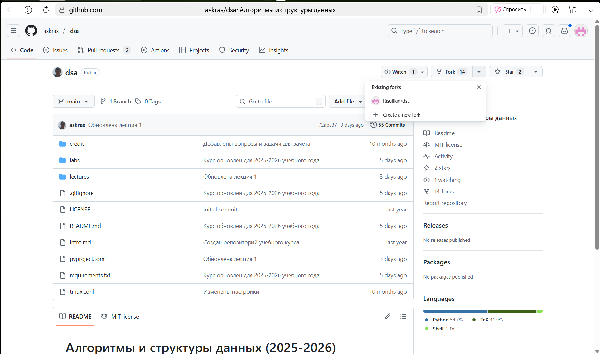
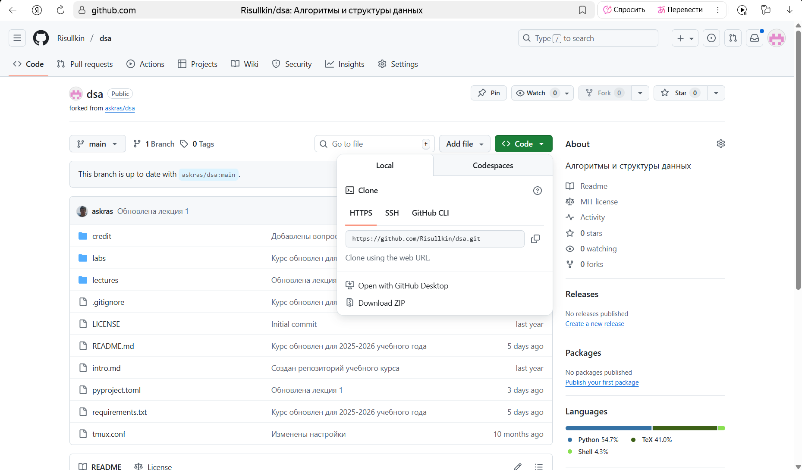
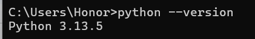
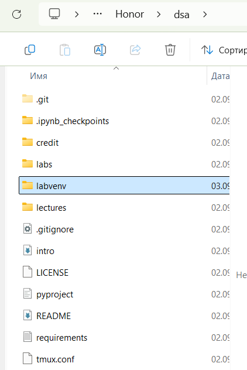
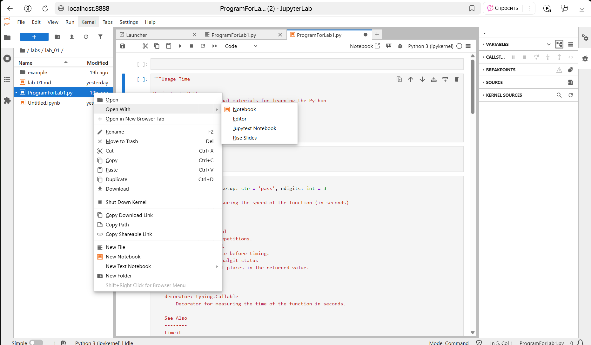

<!-- #region -->
# Установка и настрока Jupiter Lab на Windows 

## Windows 11 Home

**Авторы: @telerink и @risullkin**

1. Скачиваем Anaconda с официального сайта: https://www.anaconda.com/download.

2. Заходим в репозиторий dsa на гитхаб https://github.com/askras/dsa и делаем форк его к себе в аккаунт:

3. В своем аккаунте выбираем репозиторий dsa и копируем ключ SSH:

4. В командной строке переходим в папку, куда хотим склонировать репозиторий и прописываем команду `git clone <вставляем наш ключ>`.

5. Проверяем установлен ли питон командой `python –version`, должны увидеть следующий результат:

(главное чтобы была написана версия питона, цифры могут отличаться, но версия должна быть не ниже 3.13, если цифр нет или текст отличается, то нужно установить питон).

6. Заходим в WindowsPowershell и переходим в папку с нашим репозиторием на ПК командой `cd <путь к папке dsa>`.
   
7. Прописываем команду `python -m venv labvenv`, должна появиться папка labvenv в папке dsa:

8. Переходим в папку labsvenv командой `cd labsvenv` и прописываем команду `.\Scripts\Activate.ps1`.

9. Возвращаемся в папку dsa командой `cd <путь к папке dsa>` и прописываем команду `pip install -r requirements.txt`, должно начаться скачивание файлов.

10. Пишем команду `jupyter lab` и в браузере должен открыться jupyter lab с нашим репозиторием dsa и возможностью запускать файлы питона:

Чтобы отключить jupyter lab закройте вкладку браузера, в Powershell нажмите `Ctrl+C` и пропишите команду `deactivate`.

<!-- #endregion -->
